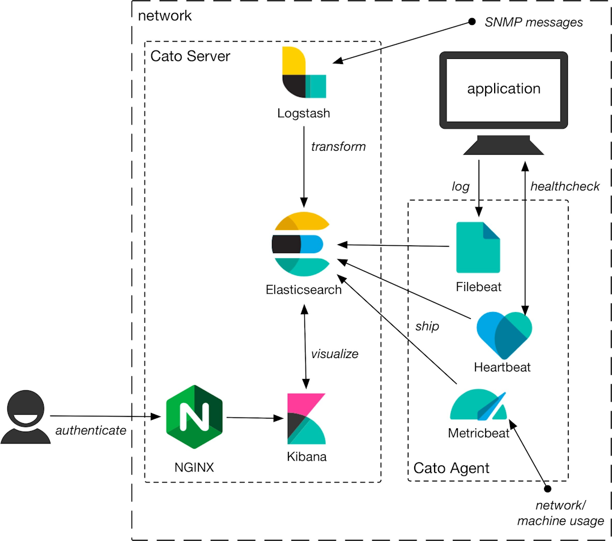

I created this architecture diagram for an application that no longer exists. Cato was the name used internally.

# Cato architecture

The following diagram illustrates the components in Cato and shows the flow of data in the solution.

Data flows through the Cato solution as follows:

1. The Cato Agent Heartbeat, Filebeat, Metricbeat, and Logstash applications collect application and network data and directly store it in Elasticsearch. In environments that include third-party applications, Logstash may transform metric data before storing it.
2. Scheduled SENTINL queries run to verify the healthy operation of the application and network being monitored.
3. If SENTINL identifies an actionable situation, it notifies the appropriate user of the details of the condition, allowing the user to take action promptly.
4. Administrative users can also log into the Cato Server from a browser, authenticating through the NGINX application, to view system health.