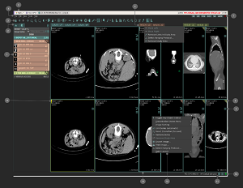
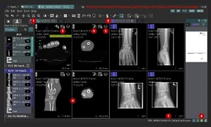

# The opportunity

In the user guide for a complex application, we were using callouts to identify and to 
briefly explain features that were visible on the main screen. 
Originally, there was a single image with more than a dozen callouts. 
When I was first started working on the product, I read this document. I noticed that it had a ton 
of helpful information, but I found it difficult to remember all of the details. This became more 
concerning as new features were added and the number of callouts for the image increased.

# The result

I thought that if I categorized the features and used a callout image for each category, it would 
be easier for the user to understand and find information. I broke the features up into four 
sections: 

- Toolsets: the configurable panels and tool bars that modify the contents in the viewports.
- Indicators: the icons that show details about the contents of the viewports, including warnings or errors.
- Study areas: the location on the screen to display images.
- Utilities: the menus and buttons that activate utilities.

Although I liked the asthetic of the original gray callouts, which were placed outside of the image with lines to connect to the associated object, I wondered if they might make the reader work a bit to identify what the callout is pointing to. 
After consulting with UX developers on other teams in the company, I moved the callout numbers to be 
directly on the image. 
I changed the callout color to red so that it would be easily seen on the image.

**Original callout image**

**Updated callout image**

Note that I included very small images to purposefully make the details indistinct.

**[< Previous](https://klpiech.github.io/portfolio)** **[Next >](https://klpiech.github.io/proc/)**