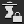
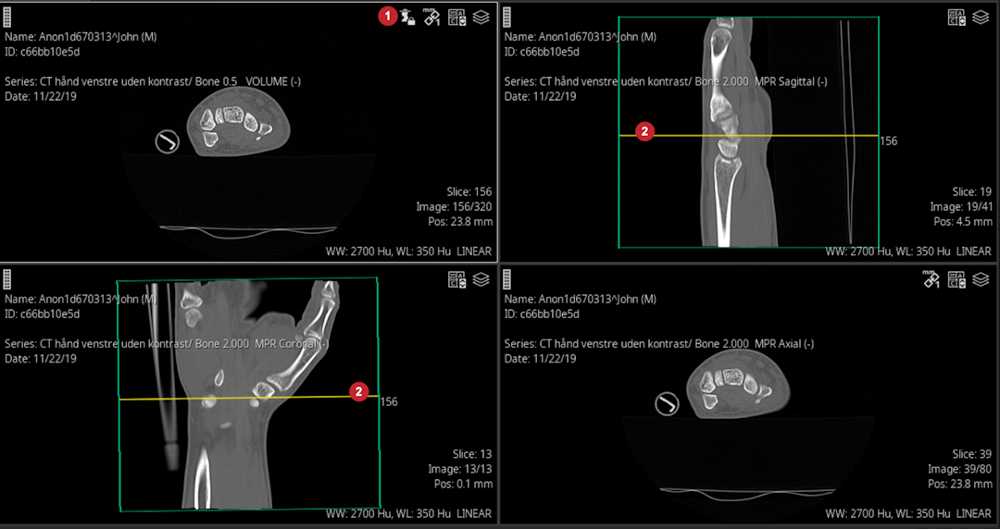

When a developer mentioned that he didn't understand a feature, I rewrote a topic on using scout lines. This sample is one of the updated procedures. Note that the end user here is very experienced and already familiar with terminology.

# Use scout lines to scroll through images

When a viewport is locked, you can scroll through the images in the stack by dragging the scout line in a scout image.

1. Make sure scout lines are activated.  
If necessary, click  on the toolbar.
2. Lock the viewport: click  in the viewport.  
When the viewport is locked, the lock icon  shows. See  following:   
  
3. In a viewport that displays the scout image, click and drag the scout line  to scroll through the images on the locked viewport (and any linked viewports).  
Note there are two scout images for the locked viewport shown.
4. To remove the lock, click  in the viewport () .
